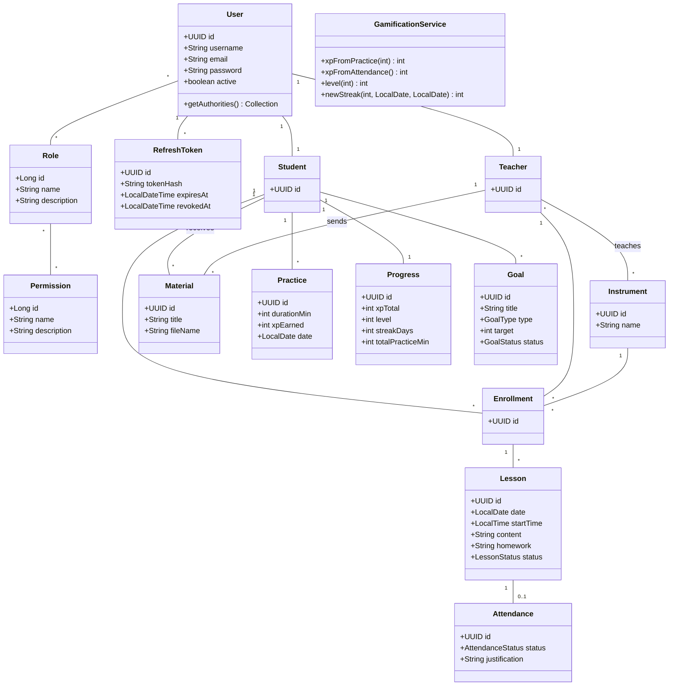
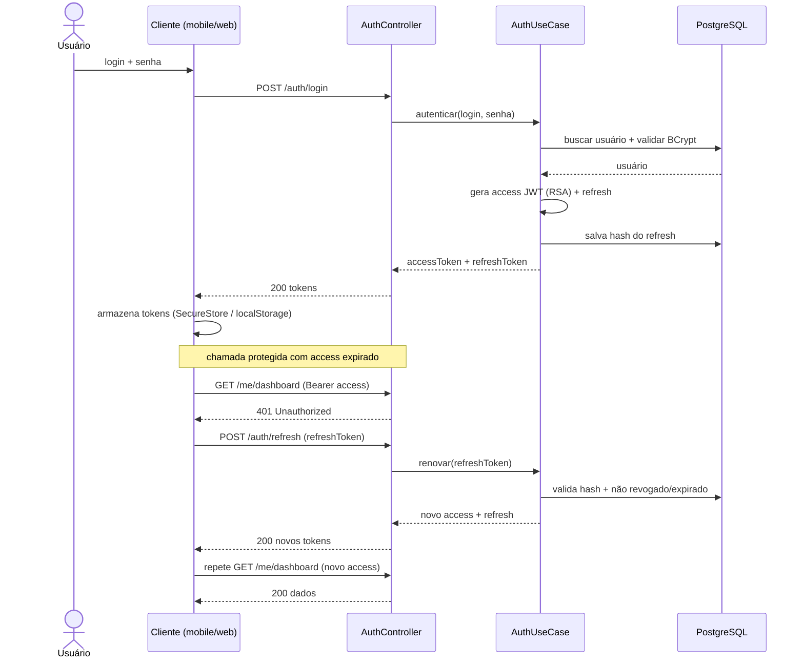
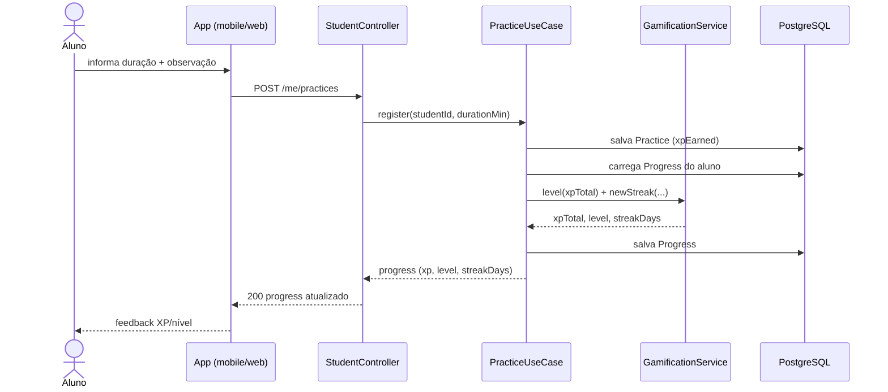
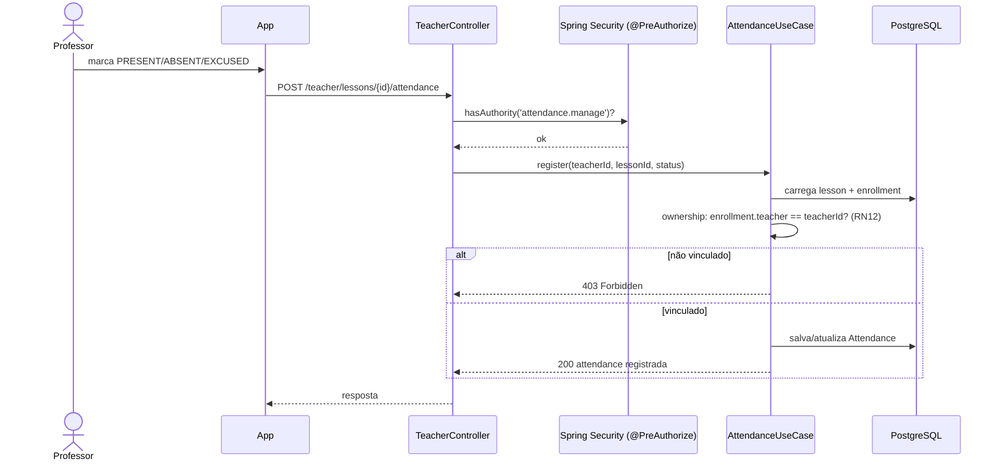
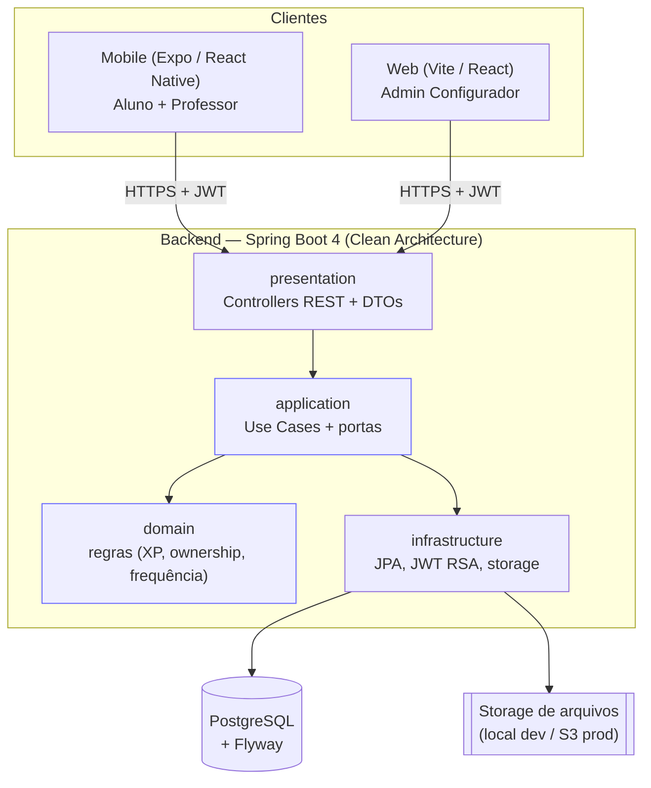

# Diagramas UML — Harmonia (entrega TCC)

Diagramas em [Mermaid](https://mermaid.js.org/) (renderizam no GitHub e em editores Markdown).
Complementam o **Diagrama ER** já existente em [`modelo-de-dados.md`](./modelo-de-dados.md).

Conteúdo:
1. [Casos de uso](#1-diagrama-de-casos-de-uso)
2. [Classes (domínio)](#2-diagrama-de-classes)
3. [Sequência — Login + refresh JWT](#3-sequência--login--refresh-de-token-jwt)
4. [Sequência — Registrar prática → XP](#4-sequência--registrar-prática--xp-gamificação)
5. [Sequência — Registrar frequência → XP](#5-sequência--registrar-frequência)
6. [Componentes / Arquitetura](#6-diagrama-de-componentes--arquitetura)

---

## 1. Diagrama de casos de uso

Três atores (Aluno, Professor, Administrador). Mermaid não tem tipo nativo de "use case";
usa-se `flowchart` com elipses (`( )`) representando casos de uso e setas ator → caso.

```mermaid
flowchart LR
    aluno([Aluno])
    prof([Professor])
    admin([Administrador])

    subgraph Auth
        uc01(("RF01 Login"))
        uc02(("RF02 Recuperar senha"))
    end

    subgraph Aluno_UC["Aluno"]
        uc03(("RF03 Dashboard XP/nível/streak"))
        uc04(("RF04 Consultar aulas"))
        uc05(("RF05 Detalhes da aula"))
        uc06(("RF06 Materiais"))
        uc07(("RF07 Registrar prática"))
        uc08(("RF08 Ver progresso"))
        uc09(("RF09 Gerenciar metas"))
    end

    subgraph Professor_UC["Professor"]
        uc10(("RF10 Dashboard"))
        uc11(("RF11 Listar alunos"))
        uc12(("RF12 Detalhes do aluno"))
        uc13(("RF13 Registrar aula"))
        uc14(("RF14 Registrar frequência"))
        uc15(("RF15 Histórico de aulas"))
        uc16(("RF16 Anexar material"))
        uc17(("RF17 Agenda"))
        uc18(("RF18 Relatórios"))
    end

    subgraph Admin_UC["Administrador"]
        uc20(("RF20-25 Cadastros"))
        uc28(("RF28 Usuários/roles/permissões"))
        uc29(("RF29 Configurações"))
    end

    aluno --> uc01 & uc02
    prof --> uc01 & uc02
    admin --> uc01

    aluno --> uc03 & uc04 & uc05 & uc06 & uc07 & uc08 & uc09
    prof --> uc10 & uc11 & uc12 & uc13 & uc14 & uc15 & uc16 & uc17 & uc18
    admin --> uc20 & uc28 & uc29
```

> RF19/RF26/RF27/RF30 (dashboard admin, reposições, financeiro, relatórios admin) são fase
> posterior; omitidos do MVP.

---

## 2. Diagrama de classes

Modelo de domínio (entidades de negócio + núcleo de segurança RBAC/PBAC). Reflete o ER, com
foco em atributos e métodos de negócio. `Administrator` = `User` com role `ADMIN` (sem classe
própria). Nomes em inglês (ver `glossario-en.md`).

---

## 3. Sequência — Login + refresh de token JWT

Autenticação stateless: access JWT curto + refresh token longo (hash SHA-256 no banco).
Quando o access expira (401), o cliente troca o refresh por um novo par automaticamente.

---

## 4. Sequência — Registrar prática → XP (gamificação)

RF07 + RN07: prática gera XP, atualiza progresso (nível, sequência/streak).

---

## 5. Sequência — Registrar frequência

RF14 + RN08/RN09: professor marca presença; ownership garante só alunos vinculados.

---

## 6. Diagrama de componentes / arquitetura

Monorepo (backend + mobile + web) sobre uma única API REST. Backend em Clean Architecture
(dependências apontam para dentro).

> **Regra Clean Architecture:** `domain` não conhece Spring/JPA. `application` depende só de
> `domain` (via portas). `infrastructure` implementa as portas. `presentation` traduz HTTP ↔ use case.
