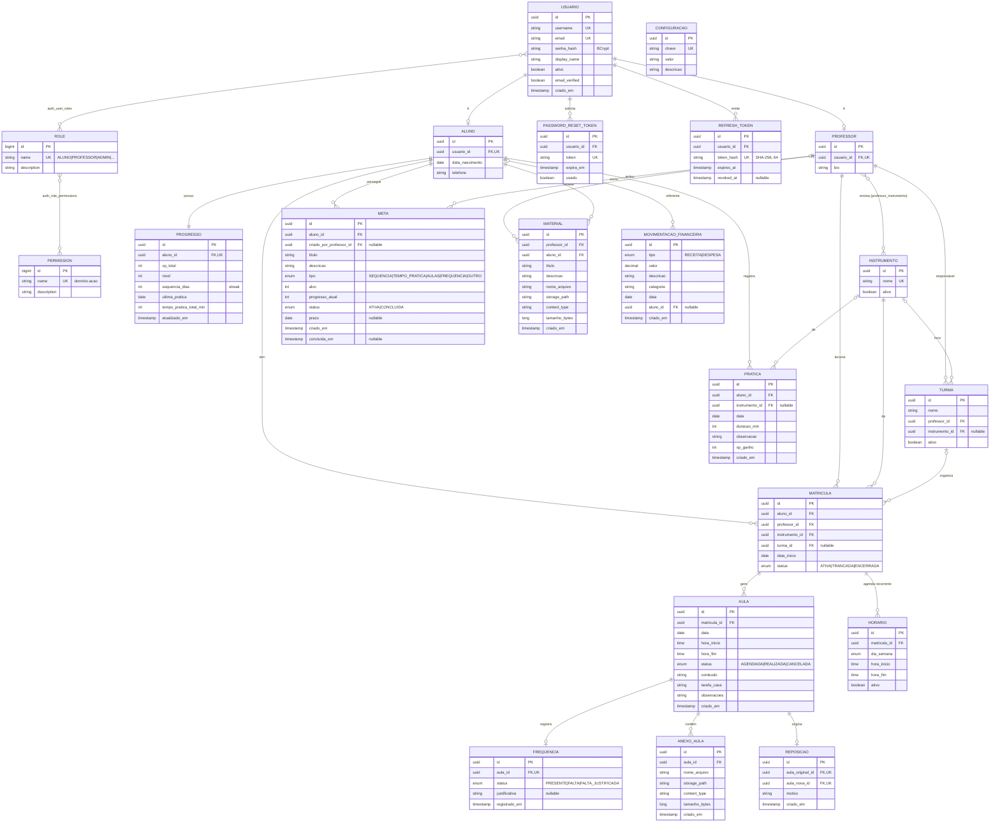

# Modelo de Dados — Harmonia

Modelo do **domínio completo** (todas as 20 entidades). MVP = Aluno + Professor;
entidades de Admin existem no schema mas seus fluxos/telas são fase 2.

> **Clean Architecture:** este modelo é o **domínio** (regras de negócio). As entidades JPA
> em `infrastructure/persistence` são adapters que **mapeiam** este domínio — não são o domínio.
> O núcleo (`domain`) não importa `jakarta.persistence`.

---

## Diagrama ER

> `CONFIGURACAO` e `PERMISSAO` ficam fora do diagrama de relações (tabelas independentes /
> fase 2). `RELATORIO` **não é tabela** — é resultado de queries de agregação (RF18/RF30).

---

## Dicionário de entidades

### Núcleo de identidade & acesso (RBAC + PBAC)
Modelo espelhado do `marreh_spring_integrations`: **Usuario —n:n— Role —n:n— Permission**.
Construído **completo já no MVP** (fundação de segurança), JWT RSA + Refresh Token.

| Entidade | Papel | Notas |
|---|---|---|
| **Usuario** | Conta + auth (RF01). Implementa `UserDetails` | `username`/`email` únicos, senha BCrypt. Autoridades = roles (`ROLE_<name>`) + permissions. |
| **Role** | Papel (RBAC) | Seed: `ALUNO`, `PROFESSOR`, `ADMIN`. n:n Permission. |
| **Permission** | Permissão fina (PBAC, RF28) | Nome `dominio.acao` (ex.: `aula.manage`). Catálogo abaixo. |
| **RefreshToken** | Sessão stateless | `token_hash` SHA-256, `expires_at`, `revoked_at`. Access JWT curto + refresh longo. |
| **Aluno** | Perfil aluno (1:1 Usuario) | Dados pedagógicos/pessoais. |
| **Professor** | Perfil professor (1:1 Usuario) | Capacidades via `professor_instrumento`. |
| **Administrador** | = Usuario com role `ADMIN` | Sem tabela própria. |
| **PasswordResetToken** | Recuperar senha (RF02) | Token com expiração, uso único. |

**Autorização em 2 camadas:**
1. **PBAC/RBAC** — `@PreAuthorize("hasRole('ADMIN') or hasAuthority('aula.manage')")` decide *qual ação*.
2. **Ownership** — filtro no use case decide *de quem é o dado* (RN11 aluno só o seu; RN12 professor só vinculados). Permissão sozinha não basta.

#### Catálogo de permissões (`dominio.acao`)
| Domínio | Permissões |
|---|---|
| auth | `auth.user.manage`, `auth.role.manage`, `auth.permission.manage` |
| aluno | `aluno.read`, `aluno.manage` |
| professor | `professor.read`, `professor.manage` |
| matrícula | `matricula.manage` |
| instrumento | `instrumento.manage` |
| turma | `turma.manage` |
| aula | `aula.read`, `aula.manage`, `frequencia.manage` |
| material | `material.read`, `material.manage` |
| gamificação | `meta.read`, `meta.manage`, `pratica.register`, `progresso.read` |
| financeiro | `financeiro.manage` |
| relatório | `relatorio.read` |
| config | `config.manage` |

#### Seed de roles → permissões
- **ALUNO** — `aula.read`, `material.read`, `meta.read`, `meta.manage`, `pratica.register`, `progresso.read` (sempre + ownership = só os próprios).
- **PROFESSOR** — `aluno.read`, `aula.read`, `aula.manage`, `frequencia.manage`, `material.read`, `material.manage`, `meta.read`, `meta.manage`, `relatorio.read` (+ ownership = só alunos vinculados).
- **ADMIN** — todas. `hasRole('ADMIN')` faz bypass de ownership (RN13).

### Estrutura pedagógica
| Entidade | Papel | Notas |
|---|---|---|
| **Instrumento** | Catálogo (RF23) | Violão, Piano, Guitarra, Canto... |
| **professor_instrumento** | n:n — o que o professor ensina (RN02) | Tabela de junção. |
| **Turma** | Organização (RF24, RN05) | Só agrupa; aula não depende dela (RN04). |
| **Matricula** | **Vínculo central** (RF22) | aluno+professor+instrumento+turma?. Base de RN11/RN12. Instrumentos do aluno (RN01) = distintos nas matrículas. |
| **Horario** | Agenda recorrente (RF17/RF25) | Slot semanal por matrícula; gera aulas. |

### Aulas, frequência, reposição
| Entidade | Papel | Notas |
|---|---|---|
| **Aula** | Aula **individual** (RN04) | Pendura em `matricula`. Conteúdo/tarefa (RF13). |
| **Frequencia** | Presença 1:1 com aula (RN08) | Sem registro em aula REALIZADA ⇒ FALTA (RN09, regra de domínio). |
| **Reposicao** | Liga aula original ↔ nova (RN10) | RF26. Gera nova `aula` vinculada. |
| **AnexoAula** | Arquivo da aula (RF05) | Armazenado em storage (RNF08). |

### Materiais
| Entidade | Papel | Notas |
|---|---|---|
| **Material** | Professor → aluno (RN06/RF16) | Aluno vê/busca/baixa (RF06). Geral, não preso a aula. |

### Gamificação (diferencial)
| Entidade | Papel | Notas |
|---|---|---|
| **Pratica** | Prática em casa (RF07) | Gera `xp_ganho`; alimenta Progresso/streak. |
| **Progresso** | Agregado 1:1 aluno (RF03/RF08) | XP, nível, sequência, tempo total. Cache de RN07. |
| **Meta** | Metas do aluno (RF09) | Ativas/Concluídas (telas Figma). Opcionalmente atribuída por professor. |

### Administração / Configurador (pós-MVP)
Módulo **Configurador Admin** — painel **web** (`admin-web/`, React+Vite). Login admin →
gestão de usuários, roles, permissões e config (equivalente ao `SecurityAdminController` do marreh).

| Entidade | Papel | Notas |
|---|---|---|
| **Usuario/Role/Permission** | Gestão de acesso (RF28) | CRUD de usuários, atribuir roles, montar roles com permissões. Backend já existe no MVP; só ganha UI. |
| **Configuracao** | Parâmetros (RF29) | Chave-valor. |
| **MovimentacaoFinanceira** | Receita/despesa (RF27) | Saldo = agregação. Fase posterior. |
| **Relatorio** | Relatórios (RF18/RF30) | **Derivado** — queries, não tabela. |

---

## Regras de domínio embutidas no modelo

- **RN04** — `aula.matricula_id` garante aula individual (matrícula = 1 aluno).
- **RN07** — XP vem de `pratica.xp_ganho` + XP por presença (`frequencia`). Fórmula no domínio (ex.: `xp = duracao_min` por prática; bônus por presença). Nível = faixa de `xp_total`. Sequência = dias consecutivos com prática.
- **RN09** — aula REALIZADA sem `frequencia` ⇒ tratada como FALTA na leitura.
- **RN10** — `reposicao` referencia `aula_original_id` e `aula_nova_id` (1:1 cada).
- **RN11** — aluno só lê dados onde `aluno_id` = ele (filtro em todo use case).
- **RN12** — professor só lê alunos com `matricula.professor_id` = ele.
- **RN13** — perfil ADMIN ignora os filtros acima.

## Decisões adotadas
1. **PK** — **UUID** em entidades de negócio/segurança sensíveis (evita ID guessing, reforça RN11/RN12). `Role`/`Permission` podem usar BIGINT (catálogo interno, igual marreh).
2. **Horário → aula** — professor cria aula **manual** no MVP; `Horario` é só referência de slot recorrente. Geração automática (job) = melhoria futura.
3. **Soft delete** — `ativo`/`status` em vez de DELETE físico (RNF05 integridade).
4. **Segurança** — RBAC+PBAC completo no MVP (fundação). UI de gestão (Configurador) = pós-MVP.

## Em aberto (próxima sessão de domínio)
- **Cálculo de XP/nível/streak** — fórmula exata: XP por minuto de prática, bônus por presença, faixas de nível, regra de streak (dias consecutivos com prática). Definir antes de codar o domínio de gamificação.

## Mapeamento Clean Architecture
- `domain/model/` — POJOs: `Aluno`, `Aula`, `Matricula`, `Progresso`, ... + value objects (`Email`, `Xp`, `PeriodoAula`).
- `domain/` — regras: cálculo de XP/nível/streak, validação de frequência, geração de reposição.
- `infrastructure/persistence/` — `*JpaEntity` + `*RepositoryAdapter` implementando portas do domínio.
- Migrations Flyway (`V1__schema_inicial.sql`, ...) refletem este ER.
